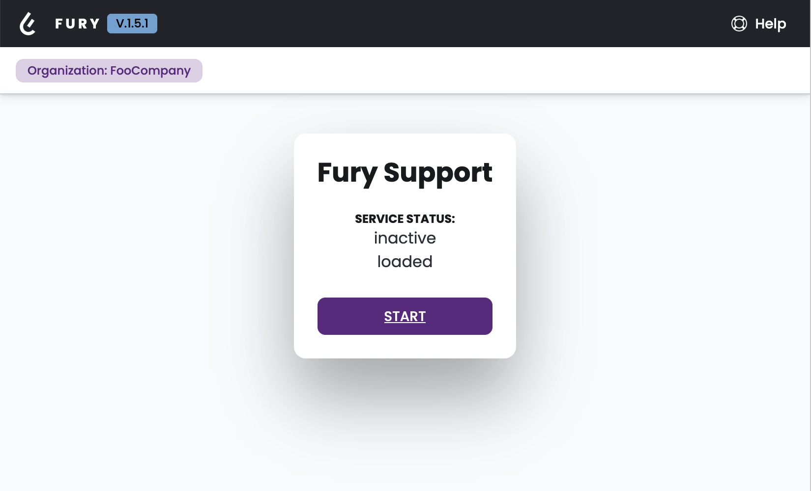
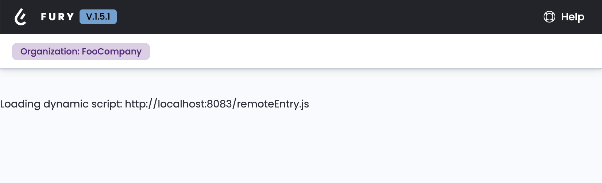

### Fury Dashboard UI

This interface will include all the future UIs related to our Fury standalone services, as per [`fury-connect-switch`](https://github.com/sighupio/fury-connect-switch).



### Local Development

Go into the `/web-client` folder and run:
- `yarn dev-local-no-backend` to run the project with no go server running
- `yarn dev-local-with-backend` to run the project with a go server

both need a config.yml in the root of the project to parse configurations.

### Build a dashboard component

There are two types of component that you can build for the Dashboard (aka FIP):
- Local/Static components (directly inside this dashboard repository)
- Remote/Federated component (built with webpack inside another repository)

In both cases they have to come under the shape of **WEB Component**, but don't worry, you can use the frameworks of your choice, you simply need to wrap the app or component you've built in a web component, here there's some library that helps you to achieve this:
- [for React](https://www.npmjs.com/package/react-to-webcomponent)
- [for Angular _draft_](https://medium.com/@kitson.mac/wrapping-an-angular-app-in-a-custom-element-web-component-angular-element-in-4-simple-steps-ded3554e9006)
- [for Vue _draft_](https://cli.vuejs.org/guide/build-targets.html#web-component)
- Svelte and Vanilla JS:
- ...

#### Local/Static component case:
(_DRAFT_)

#### Remote/Federated Module case:
(_DRAFT_)
Once wrapped your project inside a webcomponent, you need to expose it as a federated module, throughout the `webpack.config.js` file, specifying `scope` `module name` `url`.

Then inside the dashboard `Services/ConfigutationLoader/ModuleAssociations.ts` you need to add your new module reference like this:

```ts
/**
 * ModuleAssociations.ts
 */
  ...
  // Mapping the name
  public static readonly names = {
		furyconnectswitchui: 'furyconnectswitchui',
		furybrandnewcomponent: 'furybrandnewcomponent',
    ...
	};
  ...
  // Associate the new component to a route
  public static routeAssociations: Associations[] = [
		{
			yamlComponentName: ModuleConstants.names.furyconnectswitchui,
			routePath        : '/support',
			componentName    : 'fury-support',
		},
		{
			yamlComponentName: ModuleConstants.names.furybrandnewcomponent,
			routePath        : '/brandnewroute',
			componentName    : 'fury-brand-new-component',
		},
    {...}
	];

```

#### [OPTIONAL] Styling ShadowDOM components
In the bad case to style the components that needs to be rendered inside a ShadowDOM, you need to create and inject a `template` that imports the global `fury-design-system` compiled styles like this:
```js
  // MyCompnent.ts
  const template = document.createElement('template');
  template.innerHTML = `<link rel="stylesheet" href="./index.css" />`
  // index.css it's the compiled file that webpack bundle

  export default class MyComponent extends HTMLElement {
    ...
    connectedCallback() {
      ...
      const shadowRoot = this.attachShadow({ mode: "open" });
      shadowRoot.appendChild(template.content.cloneNode(true));
    }
  }
```

```js
  // app.tsx
  window.customElements.define("my-component-tag", MyComponent);
```
After that you'll have global style also inside your component, now if you want to add custom rules for your component you can simply add a `MyComponents.scss` file and target your component like this
```css
  /* MyComponent.scss */
  my-component-tag {
    /* Your SCSS Rules */
  }
```
#### [WARNING] Css and ShadowDOM
Keep in mind that css of imported shadowDOM components will not be included because of the shadowDOM encapsulation!!!

**WATCH OUT** This project needs other active services (for now only one) to shows the true aggregator functionality of dashboard. You can see the whole picture by downloading and running also the [`fury-connect-switch`](https://github.com/sighupio/fury-connect-switch/tree/ui) project.

If no services will be found, you'll simply see the empty dashboard, and a text that tells about the services you are trying to import.


